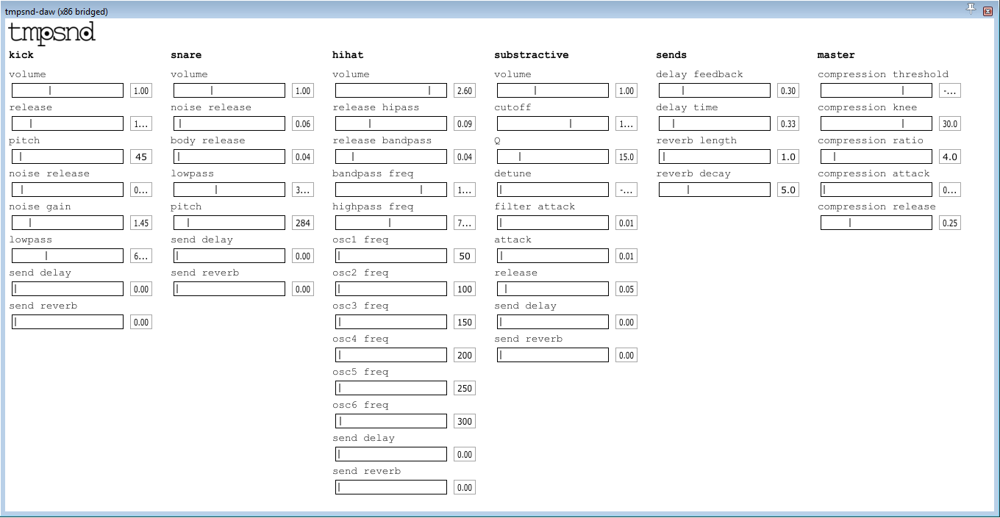

# tmpsnd-daw

VST plugin to author tmpsnd tracks in a DAW, written in C++ using Juce and `libwebsockets`



# General order of operation

The VST, when loaded, creates a WebSocket server on port 7681. It waits for
configuration data, sent by the web browser. Then it creates a bunch of sliders,
that are VST parameters, that can be automated. When it receives incoming MIDI
events or parameter change events, it sends that to the WebSocket, using the
following text protocol:

- Parameter change: `time,index,value`:
   * `time` is the time where the event happened in seconds (floating point)
   * `index` is the index of the parameter (integer)
   * `value` is the new value of the parameter (float).
- Note On: `time,index,note,velocity`:
   * `time` is the time where the event happened in seconds (floating point)
   * `index` is the index of the instrument, which is equal to the midi channel
     where the note was sent from (integer)
   * `note` the MIDI note for this event
   * `velocity` the MIDI velocity for this event
- Note Off: `time,index`
   * `time` is the time where the event happened in seconds (floating point)
   * `index` is the index of the instrument, which is equal to the midi channel
  where the note was sent from (integer)

# Configuration

The first thing that you need to do when the VST in inserted on a track is to open up your web page that contains you synth. It should connect to a websocket on the machine that runs the DAW (or `localhost` of course), on port 7681.

Then the web browser should send a JSON-formatted string to tell the VST what are the parameter for this synth. The format goes like this, say, to define a snare drum, with two parameters, `noise` and `pitch`, two sends, `delay` and `reverb`, with parameters, and a master channel bus effect where you have a compressor with settable ratio:

```json
{
  "snare": {
    "noise": {
      "min": 0.0,
      "max": 2.0,
      "step": 0.1,
      "default": 0.8
    },
    "pitch": {
      "min": 200.0,
      "max": 1000.0,
      "step": 1.0,
      "default": 400.0
    }
  },
  "sends": {
    "reverb": {
      "decay": {
        "min": 0.0,
        "max": 20.0,
        "step": 0.1,
        "default":5.0
      }
    },
    "delay": {
      "feedback": {
        "min": 0.0,
        "max": 150.0,
        "step": 1.0,
        "default":30.0
      }
    }
  },
  "master": {
    "compression": {
      "ratio": {
        "min": 0.0,
        "max": 20.0,
        "step": 0.1,
        "default":4.0
      }
    }
  }
};
```

This will create VST parameters for each parameter of each instruments, and a parameter for each send for each instrument (to control the send gain). Then it will create parameters for the send effects parameters and the master bus effects parameters.

Parameters are normal VST parameters, they can be automated and everything.

# How to build?

Get a copy of the VST SDK 2.4 from steinberg. Put it in `~/SDKs/vstsdk2.4` (`C:\SDKs\vstsdk2.4` on Windows). I
can't redistribute it here. You might or might not have to create an account at
Steinberg.

## Windows

The DLL for `libwebsockets` and its associated header files are included in this repo for convenience. Just open `Builds\VisualStudio2015\tmpsnd-daw.sln` in Visual Studio 2015 Community Edition (that is free for open source work), and press `F5`. You'll find the DLL in `Builds\VisualStudio2015\Debug` or `Builds\VisualStudio2015\Release`, depending on if you did a debug or release build in Visual Studio.

## Linux

Install libwebsockets. For example, on Debian/Ubuntu, run `sudo apt-get install
libwebsockets`. Then, `cd Builds/Linux/`, and `make`. That gives you a `.so`
file that you can load in a DAW in `Builds/Linux/build`.

## OSX

Install libwebsockets. The version in `brew` is fine:
`brew install libwebsockets`.

Open the XCode project that is at `Builds/MacOSX/tmpsnd-daw.xcodeproj`, and
build that. That gives you a thing that is called `tmpsnd-daw.component` in
`Builds/MacOSX/build/Debug/`. You can load that in your DAW.

# How to debug?

When loaded in a DAW, you can simply attach a debugger to the DAW (or the bridge process of the DAW),
and debug from there. I
recommend using the `Audio Plugin Host` from the Juce library, that is very
lightweight, open source, and runnable in gdb/lldb/rr/valgrind easily.

# License
The code in `Source/` has been written by the authors of this project and is licensed under the terms of the new BSD license.
